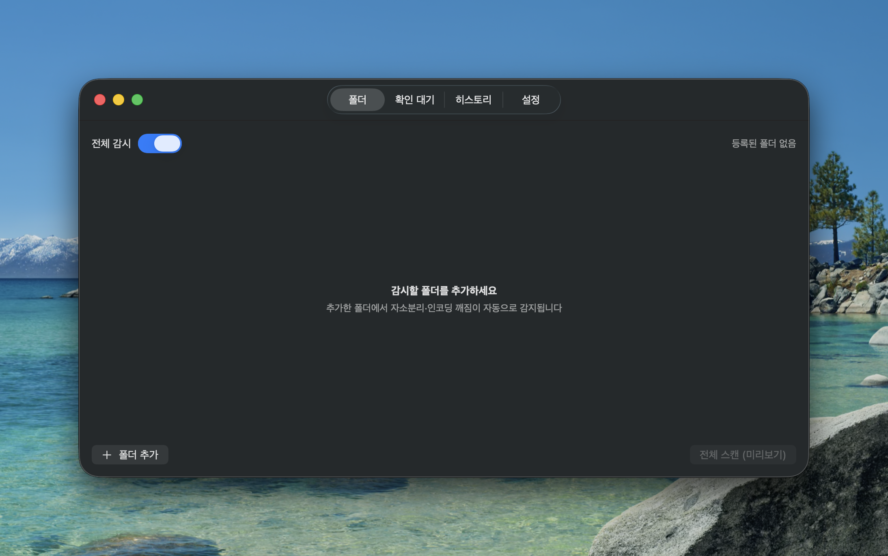
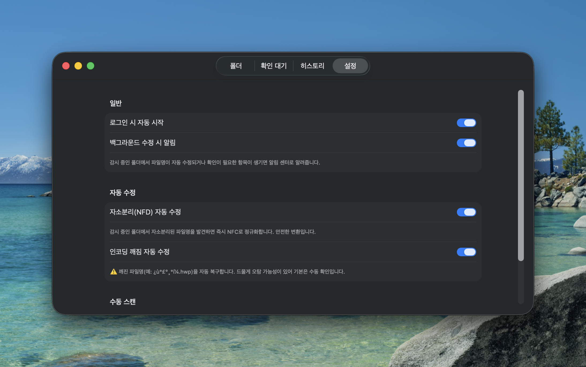

<div align="center">


# JamoFix

**A macOS app that automatically fixes broken Korean filenames (jamo separation & encoding corruption) when moving files between Mac and Windows**

English · [한국어](README.md)


</div>

---

## Why?

Send a file made on a Mac to Windows and its Korean name often breaks. There are two
root causes.

| Symptom | Cause | JamoFix fix |
|---|---|---|
| **Jamo separation** (`ㅎㅏㄴㄱㅡㄹ.txt`) | macOS stores filenames in decomposed **NFD** form. It looks composed on a Mac, but Windows / web / Linux render it as separated jamo. | Normalize NFD → **NFC** (safe, automatic) |
| **Mojibake** (`¿ù°£º¸°í¼­.hwp`) | Unzipping a Windows-made archive misreads CP949 bytes as Latin-1, etc. | Reverse-engineer the encoding and **recover** (`월간보고서.hwp`) |
| **Won't open on Windows** | `\ / : * ? " < > \|`, reserved names (`CON`), trailing spaces/dots are forbidden on Windows. | **Sanitize** to safe characters |

> 💡 macOS composes NFD names on screen, so they look fine to *you*. JamoFix shows the
> **real separated form** (`ㅎㅏㄴㄱㅡㄹ.txt`) in previews so it's clear what is being
> fixed and why.

## Features

- 🔍 **Continuous folder watching** — FSEvents-based; new files are checked instantly with near-zero CPU
- ⚡ **Auto vs. manual policy** — NFD normalization is safe, so it's automatic; encoding recovery defaults to manual confirmation to avoid false positives
- 👀 **Dry-run preview** — see before → after, then approve
- ↩️ **Undo** — every change is recorded and reversible in one click
- 🔀 **Conflict handling** — appends ` (1)` on name clashes; safely works around APFS's normalization-insensitive lookups
- 🎛 **Menu bar toggle** — enable/disable globally or per folder
- 🔔 **Notifications & launch at login** — background-fix alerts, auto start on login
- 🫥 **Appearance options** — hide the menu bar (top) icon and/or the Dock (bottom) icon to run quietly (at least one is always kept)
- 🌐 **Korean / English** — UI switches automatically based on the macOS system language

## Screenshots

| Preview | Setting |
|---|---|
|  |  |

## Install

### From DMG (recommended)

1. Download the latest `JamoFix-x.y.z.dmg` from [Releases](../../releases)
2. Open the DMG and **drag JamoFix.app to Applications**
3. Launch it (on first run, if Gatekeeper blocks it, **right-click → Open**)

> The build is ad-hoc signed, so other Macs show a warning. Public distribution needs an
> Apple Developer ID signature + notarization.

### Build from source

```bash
git clone <this repo url>
cd JamoFix
swift run                     # dev run
swift run jamofix-selftest    # core logic tests (no Xcode needed)
Scripts/package.sh            # build .app + DMG into dist/
```

## Usage

1. **Folders tab → "Add Folder"** to register a folder to watch (Downloads, a work folder, etc.)
2. When a jamo-separated file appears → it's **normalized to NFC automatically**
3. When a corrupted name like `¿ù°£º¸°í¼­.hwp` is found → review the recovery in the **Pending tab** and approve
4. Made a mistake? → revert from the **History tab**
5. Pause anytime → menu bar **한** icon → toggle "Watch filenames"

> Registering Downloads/Desktop/Documents triggers a macOS permission prompt — allow it.

## How it works (the tricky parts)

Filename normalization on macOS is full of traps. What JamoFix actually had to solve:

- **`FileManager.moveItem` and `URL` path APIs re-decompose names back to NFD.** A naive
  implementation leaves you "fixed but still separated." → We call POSIX `renamex_np`
  directly to write the NFC bytes verbatim.
- **APFS looks up files ignoring normalization.** An NFD→NFC rename of the *same* file is
  done via a two-step rename through a temporary name.
- **FSEvents delivers the pre-rename NFD path.** Trusting it re-fixes the same file
  forever in a loop. → We re-verify against the real on-disk directory entry.


## License

MIT
